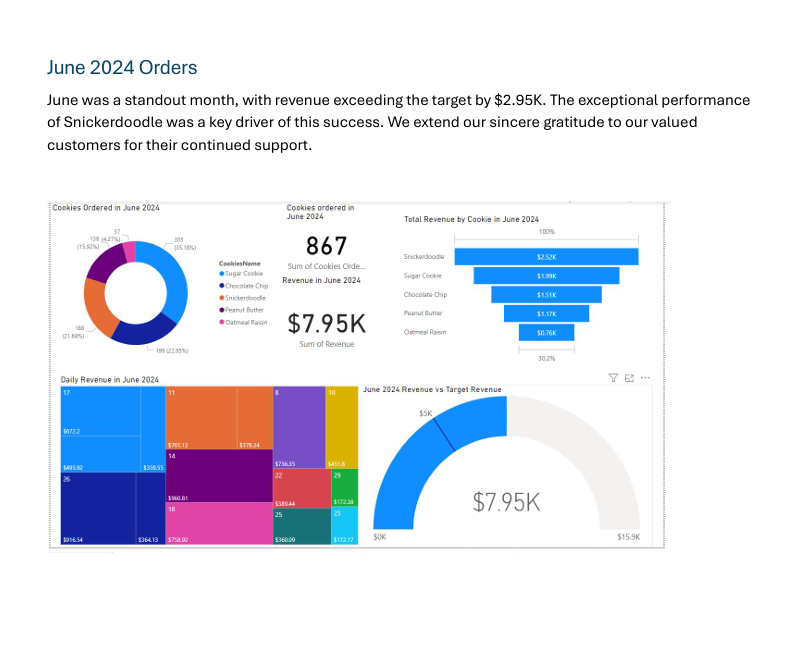

Project Title:Creating a Database Project for a Fictional Cookie Business

Understanding the Task:
Create a database in MS Access using three Excel files: Customers, Orders, and Products.

Setting Up the Database:
Create a New Database: Open MS Access and create a new blank database.
Import Excel Data: Import the three Excel files into the database, creating separate tables for each: Customers, Orders, and Products.

Designing the Database Tables
Customers Table:

Fields: FirstName, LastName, Email, Address, Phone, City, State, Zip, Country, Notes
Data Types: Text (for most fields), Number (for Zip)
Orders Table:

Fields: CustomerID, ProductID, OrderDate, CookiesOrdered, PricePerCookie, Revenue, OrderFilled
Data Types: Number (for CustomerID, ProductID, CookiesOrdered, PricePerCookie, Revenue), Date/Time (for OrderDate), Yes/No (for OrderFilled)
Products Table:

Fields: CookieID, CookieName, Price
Data Types: Number (for CookieID), Text (for CookieName), Number (for Price)

Establishing Relationships
Customers to Orders: Create a one-to-many relationship between Customers and Orders. The primary key in Customers (e.g., a unique customer ID) should be the foreign key in Orders.
Products to Orders: Create a one-to-many relationship between Products and Orders. The primary key in Products (e.g., a unique cookie ID) should be the foreign key in Orders.

Creating Queries:
Customer-Related
Most Frequent Customers: Identify the customers who have placed the most orders.
Customer Revenue: Calculate the total revenue generated by each individual customer.
Product-Related
Product Sales: Determine the total sales for each product.
Unfilled Orders: List all orders that have not been filled.
Order-Related
Order Details: Retrieve detailed information about orders placed in the last month.

Exporting and Analyzing Data
Export Queries: Export the query results to Excel files.
Power BI Analysis: Connect to the Excel files in Power BI and create visualizations to analyze the data.

