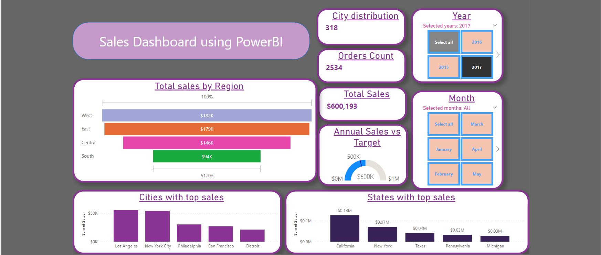

Project Title: Sales Analysis and Forecasting using Power BI 

Description:
This project focuses on analyzing and forecasting sales and orders data, providing valuable insights for business decision-making. 

Key features include:
Yearly/Monthly Analysis: Comprehensive examination of sales and orders trends over time.
Top Performers: Identification of the top 5 key performing cities and states using filters.
Key Metrics: Clear visualization of Total Sales, Order Count, and Annual Sales vs. target through informative cards.
Interactive Exploration: Utilization of funnel charts, bar charts, and slicers for dynamic data exploration.
Sales and Orders Forecasting: Accurate prediction of future sales and orders for the next few quarters.
Regional Drill-Down: Detailed analysis and forecasting at the region, state, and city levels.

Results and Insights:
Highly Interactive Power BI Dashboard: The Power BI dashboard offers a highly interactive experience, allowing users to drill down into sales and orders data at various levels, including year, month, region, state, and city. This flexibility enables targeted analysis and valuable insights.

