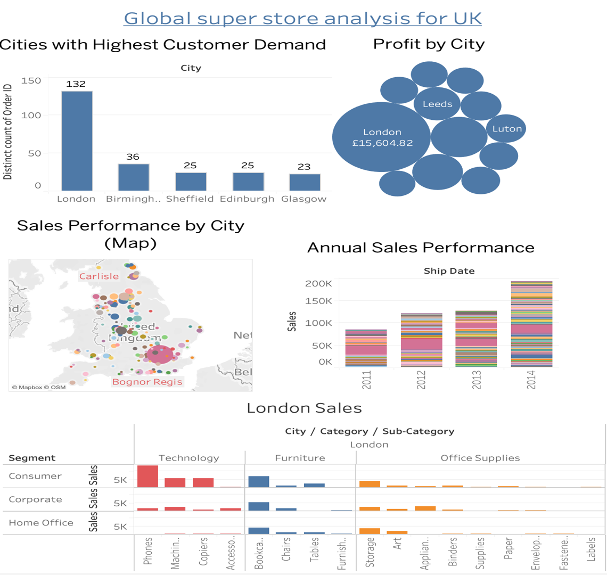

Project Title:Global Superstore Analysis Tableau project

Description:
Analyzing Superstore data, identifying key performing cities in terms of Profit, Sales and key products to help in decision making. Also Identifying improvement in shipping time over years.

Results and Insights:
Conducted a comprehensive analysis of Superstore data to pinpoint top-performing cities based on profit, sales, and key products, aiding informed decision-making. Additionally, examined trends in shipping times over the years. 

